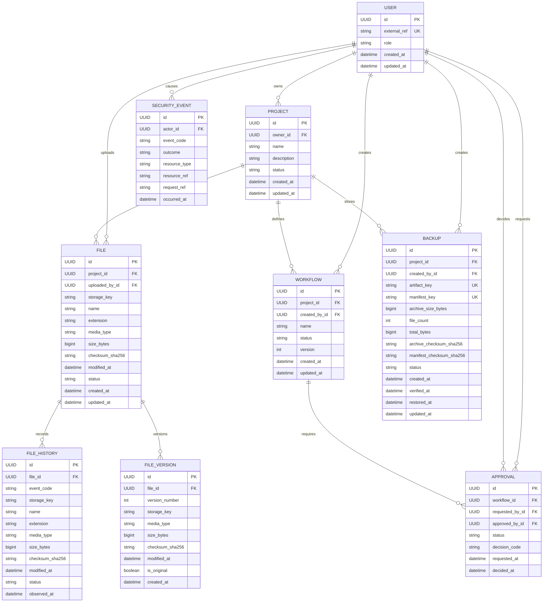

# Database schema

Normalized PostgreSQL-compatible schema. Foreign keys express
ownership and lifecycle, while indexes support searchable file records and
audit queries.



## Design notes

- `users.external_ref` is an opaque identity reference. The database does not
  store passwords, access tokens, email addresses, or profile records.
- `files` stores searchable metadata, the latest SHA-256 checksum, and a
  lifecycle status. File contents remain in the approved filesystem boundary.
- `file_history` stores immutable metadata snapshots for `created`, `updated`,
  `missing`, and `restored` inventory events; it never stores file contents.
- `file_versions` provides a per-file version number and immutable metadata
  reference. Each file can have one original version and later versions without
  changing the original record.
- `backups` stores generated relative artifact keys, manifest/archive checksums,
  byte counts, status, and lifecycle timestamps. Archive bytes remain outside
  the database and outside the project source tree.
- `workflows` are versioned per project with a unique `(project_id, name,
  version)` key. `approvals` are separate records so each decision has its own
  lifecycle and actor references.
- `security_events` is structured and intentionally small. It stores event and
  resource references, not raw request bodies, credentials, IP addresses, or
  user-agent strings.
- Project, file, and workflow relationships use cascading deletion within a
  project. Actor references use `SET NULL` so an identity record can be removed
  without destroying audit history.
- Indexes cover project ownership/status, file lookup by project/status,
  file-history lookup by file/time, workflow status, approval status, and
  backup lookup by project/status and time, and security-event lookups by
  actor/code and time.

## Migration

Set `DATABASE_URL` in the shell or a local environment file, then apply the
latest migrations:

```bash
export DATABASE_URL='postgresql+psycopg://localhost/ccl_suite'
.venv/bin/python -m alembic upgrade head
```

The migration creates tables and constraints only; it does not insert personal
data or seed credentials.
