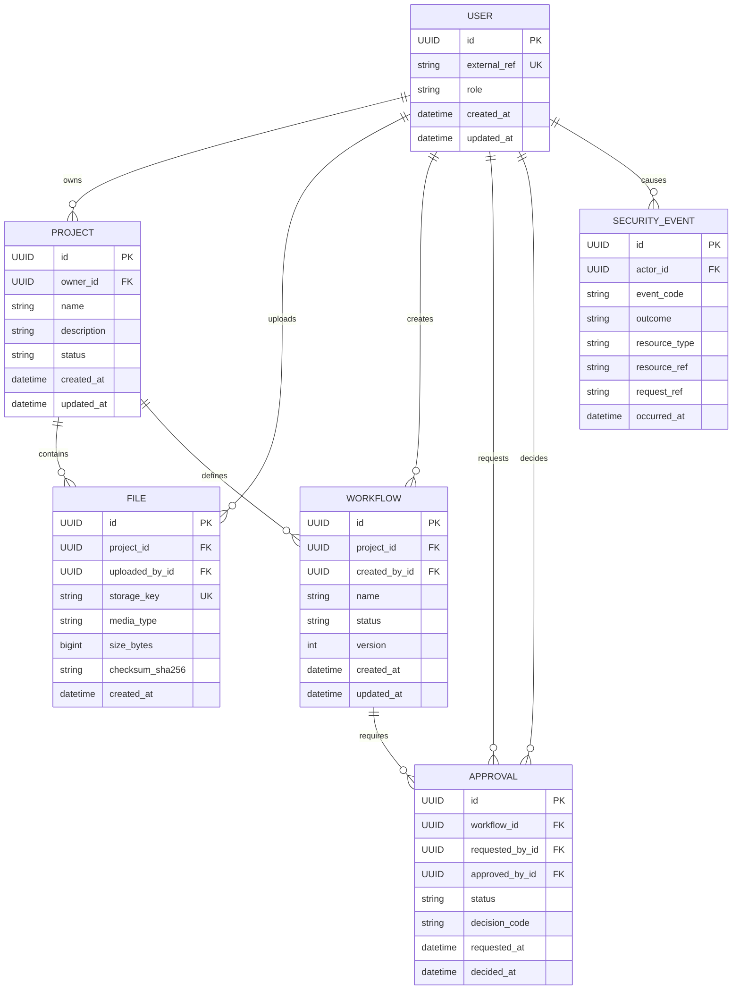

# Database schema

Day 4 uses a normalized PostgreSQL-compatible schema. Foreign keys express
ownership and lifecycle, while indexes support the list and audit queries that
the API will need.



## Design notes

- `users.external_ref` is an opaque identity reference. The database does not
  store passwords, access tokens, email addresses, or profile records.
- `files` stores object metadata and a checksum only. File contents and original
  filenames stay in the object-storage boundary.
- `workflows` are versioned per project with a unique `(project_id, name,
  version)` key. `approvals` are separate records so each decision has its own
  lifecycle and actor references.
- `security_events` is structured and intentionally small. It stores event and
  resource references, not raw request bodies, credentials, IP addresses, or
  user-agent strings.
- Project, file, and workflow relationships use cascading deletion within a
  project. Actor references use `SET NULL` so an identity record can be removed
  without destroying audit history.
- Indexes cover project ownership/status, file lookup by project and time,
  workflow status, approval status, and security-event lookups by actor/code
  and time.

## Migration

Set `DATABASE_URL` in the shell or a local environment file, then apply the
first migration:

```bash
export DATABASE_URL='postgresql+psycopg://localhost/ccl_suite'
/home/wellington/env/bin/python -m alembic upgrade head
```

The migration creates tables and constraints only; it does not insert personal
data or seed credentials.
