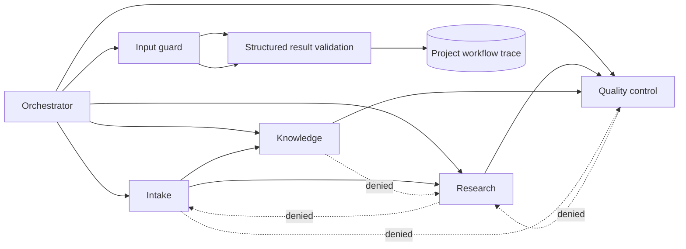

# Multi-Agent Security

This document describes the local specialist-agent boundary used by the workflow
orchestrator. The implementation is deterministic and project-scoped: it does
not execute arbitrary model code, shell commands, or unapproved tools.

## Responsibility matrix

| Agent | Responsibility | Permitted tools | Approved handoff targets |
| --- | --- | --- | --- |
| Intake specialist | Check the brief, scope, owner, deadline, and expected outputs. | None | Research, Knowledge |
| Research specialist | Summarize evidence-review state and surface claims that need attention. | `research.summary` | Quality control |
| Knowledge specialist | Report readiness of approved project knowledge sources. | `knowledge.search` | Quality control |
| Quality-control specialist | Check workflow readiness, outstanding reviews, and approval blockers. | `files.summary`, `research.summary` | None |

The orchestrator may start any specialist. A specialist may only use the
handoff edges listed above. The API never accepts a free-form agent name or
tool name.

## Handoff flow

## Handoff contract

`POST /workflows/{workflow_id}/handoffs` accepts a source agent, a target
specialist, and optional bounded context. The context is treated as untrusted
input. It is checked for blank values, length, absolute/traversal paths, and
known instruction-shaped injection patterns before the specialist runs.

Every attempt receives a unique trace ID. The database stores only a SHA-256
fingerprint and a safe presence summary for the input; it does not store the
raw handoff text. Successful results must contain the requested agent, a
completed status, a short summary, and scalar metrics. Nested payloads and
secret-bearing metric names are rejected. Unknown result fields, non-finite
numbers, and control characters in the bounded context are rejected as well,
so a trace cannot become a hidden multiline instruction channel.

`GET /workflows/{workflow_id}/handoffs` returns the bounded trace history. The
workflow ID is resolved through the project access boundary before a trace is
read or written, so an actor cannot use a handoff endpoint to cross projects.

## Security test report

| Threat case | Guardrail | Observable result |
| --- | --- | --- |
| Instruction override or secret-extraction prompt | Reuse the knowledge injection scanner before execution. | Handoff is recorded as `blocked` with a rule code; raw input is absent. |
| Absolute or traversal path | Reject absolute paths, `.`/`..` segments, backslashes, and NUL characters. | Handoff is recorded as `blocked` with `invalid_input`. |
| Delegation outside the approved graph | Validate source/target against the responsibility matrix. | Handoff is recorded as `blocked` with `delegation_not_allowlisted`. |
| Archived workflow reuse | Reject new specialist work after archival. | Handoff is recorded as `blocked` with `workflow_archived`. |
| Malformed or secret-bearing specialist output | Validate result shape and scalar metrics before persistence. | Run is marked `failed` without persisting the unsafe result. |
| Cross-project workflow reference | Apply the existing project access policy first. | Endpoint returns the same project-not-found response used by other protected workflow routes. |
| Unnecessary sensitive trace data | Persist IDs, fingerprints, summaries, and counts only. | Security events contain the workflow and trace reference, not request contents. |

Security events use `agent.handoff.completed`, `agent.handoff.blocked`, and
`agent.handoff.failed` codes. This links the operational audit stream to the
workflow-level trace without duplicating source content.

## Verification boundary

The current prototype proves role separation, delegation blocking, bounded
input handling, structured output validation, project scoping, migration
coverage, and browser-visible trace feedback. It is not a claim that arbitrary
third-party model providers or unrestricted external tools are safe; those
integrations require a separate provider boundary and threat review.
