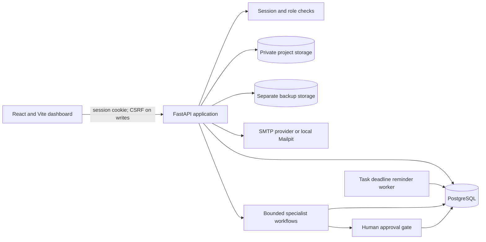

# System architecture

CCL Suite is a browser-based project operations application. It combines
project-scoped file operations, approved-source knowledge workflows, research
review, approvals, bounded specialist-agent handoffs, and operational
monitoring.

## Runtime overview

The Vite frontend is built into static assets served by the API. FastAPI owns
request validation, authorization, workflow state transitions, and access to
the database and filesystem. PostgreSQL stores identities, project metadata,
workflow and approval state, audit events, research reviews, and knowledge
metadata. Project files and backup archives are stored separately from the
relational records.

## Main data flows

1. **Identity and access:** an invite-only account signs in to receive a
   revocable server-side session. The session cookie is `HttpOnly`; state
   changes also require the CSRF cookie value in the request header. The API
   loads the stored role and checks project ownership or the elevated
   supervisor/administrator boundary. Password recovery uses short-lived,
   single-use token digests, generic request responses, rate limits, and
   session revocation after a successful reset.
2. **Files and recovery:** upload and file operations are confined to the
   active project's storage root. Inventory persists metadata and checksums;
   generated plans and manifests are kept in reserved internal paths. Backup
   archives use a separate storage root and can restore only to a new path
   within the owning project's storage directory.
3. **Knowledge:** a project file is registered as a source, reviewed, and
   ingested only after approval. Search is restricted to eligible sources.
   Answers are extractive and cite source passages; this release does not send
   source content to an external LLM provider.
4. **Research:** extraction creates a bounded preview. Scope and evidence
   checks produce warnings for human review. Corrections, verification, and
   approval are persisted with review events; the service does not treat an
   extracted statement as verified merely because it was extracted.
5. **Workflows and agents:** workflow state, action intents, approvals, and
   handoff traces are persisted. Specialist roles use bounded tools and
   explicit approval controls rather than receiving unrestricted authority.
6. **Task reminders:** a separate restricted worker periodically selects due
   tasks assigned to active project members and writes private inbox events.
   Calendar dates use the configured IANA timezone. A database uniqueness key
   prevents duplicate reminders after retries or overlapping runs. It sends
   no email.
7. **Monitoring:** security events, alert records, and weekly report metrics
   are derived from application records. Security-alert checks are
   user-triggered; task reminders do not evaluate or escalate security alerts.

## Trust and storage boundaries

- Protected operations require an active session and role permission. The
  frontend is not an authorization boundary; the API repeats the checks.
- Project-scoped operations check the owning project on the server. A selected
  project ID or client-supplied actor ID is not trusted as authorization.
- The Compose API runs as an unprivileged user with a read-only root
  filesystem and dropped Linux capabilities. Persistent project and backup
  volumes are initialized separately and are not interchangeable.
- File writes and restores are designed not to replace existing destinations.
  Backups are checksummed and subject to a configurable aggregate storage cap.
- Sanitized sample files are provided for demonstration. They are not evidence
  of production data approval or external model-provider suitability.

## Deployment profile and known limits

The checked-in Compose profile binds API, database, and Mailpit ports to
loopback. It is intended for local development and controlled demonstrations.
Remote operation requires HTTPS, production cookie settings, a browser-facing
public URL, a real mail provider, an explicit database backup policy, and an
approved owner for secrets and maintenance. Project-file backups do not back
up PostgreSQL. Task deadline reminders run in the local Compose profile;
security-alert evaluation remains user-triggered and has no background
scheduler.

For the normalized table relationships, see the
[database schema](database-schema.md). Security controls for specialist
handoffs are described in [multi-agent security](multi-agent-security.md).
